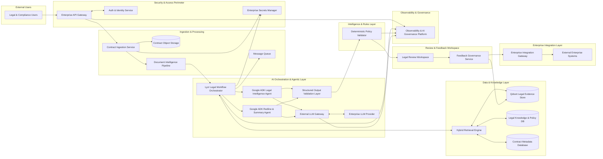

# Product Requirements Document

## Executive Summary
The Legal AI Contract Compliance Platform is an enterprise-grade solution designed to automate the review, risk assessment, and redlining of legal contracts. By leveraging a dual-agent architecture powered by Google ADK and Lyzr, grounded in a Qdrant hybrid retrieval layer, the system ensures high-precision analysis with deterministic safety rails. The platform transitions from a hackathon MVP to a production-ready system by integrating comprehensive security, observability, and AI governance directly into the core architecture.

## Problem Statement
Legal departments and compliance officers face significant bottlenecks in reviewing high volumes of contracts. Manual review is slow, prone to human error, and inconsistent. Existing AI solutions often suffer from hallucinations, lack of grounding in corporate policy, and insufficient security for sensitive legal data, making them difficult to clear for enterprise production use.

## Objectives
*   **Efficiency:** Reduce contract review time by 70% through automated clause analysis and redlining.
*   **Accuracy:** Achieve high-precision grounding using Hybrid RAG (Dense + Sparse) via Qdrant.
*   **Safety:** Implement a Deterministic Policy Validator to ensure AI findings align with hardcoded legal rules.
*   **Enterprise Readiness:** Provide a zero-trust security model, full observability, and a human-in-the-loop feedback loop.

## Scope
*   **In-Scope:** Secure ingestion, clause segmentation, hybrid retrieval, dual-agent reasoning (Google ADK), deterministic validation, human review workspace, and enterprise integration (CRM/ERP).
*   **Out-of-Scope:** Full replacement of legal counsel; the system is a co-pilot/decision-support tool.

## Stakeholders
*   **Legal Counsel:** Primary users for review and approval.
*   **Compliance Officers:** Define and manage the Legal Knowledge & Policy DB.
*   **IT/Security Teams:** Oversee the Enterprise API Gateway and Identity Service.
*   **DevOps/SRE:** Manage the Observability and Resilience layers.

## Functional Requirements

### FR-101: Secure Contract Ingestion
*   **Description:** System must support PDF and DOCX uploads with multi-stage validation.
*   **Priority:** P0
*   **Acceptance Criteria:** Files scanned for viruses; MIME type validated; maximum file size enforced.

### FR-102: Clause Segmentation
*   **Description:** Decompose documents into individual legal clauses for granular analysis.
*   **Priority:** P0
*   **Acceptance Criteria:** Accurate extraction of text and layout using Document Intelligence Pipeline.

### FR-103: Hybrid Retrieval (RAG)
*   **Description:** Query Qdrant using both dense embeddings and sparse vectors to find relevant legal evidence.
*   **Priority:** P0
*   **Acceptance Criteria:** Retrieval of top-K relevant clauses from the Legal Evidence Store.

### FR-104: Multi-Agent Reasoning (Google ADK)
*   **Description:** Use a Legal Intelligence Agent for analysis and a Redline Agent for synthesis.
*   **Priority:** P0
*   **Acceptance Criteria:** Agents must use the CRISPE framework and return structured JSON.

### FR-105: Structured Output Validation
*   **Description:** Validate all LLM outputs against Pydantic schemas before processing.
*   **Priority:** P0
*   **Acceptance Criteria:** Malformed JSON triggers an automatic repair prompt or human escalation.

### FR-106: Deterministic Policy Validation
*   **Description:** Apply hardcoded business rules to AI findings to calculate risk scores.
*   **Priority:** P0
*   **Acceptance Criteria:** High-risk or low-confidence findings are routed to the Human Review Workspace.

### FR-107: Human-in-the-Loop Feedback
*   **Description:** Capture reviewer corrections to update the Qdrant Evidence Store.
*   **Priority:** P1
*   **Acceptance Criteria:** Approved redlines are stored as "Human-Verified Evidence" for future grounding.

### FR-108: Enterprise System Sync
*   **Description:** Push finalized contract data to external CLM/ERP systems.
*   **Priority:** P1
*   **Acceptance Criteria:** Successful data transmission via the Enterprise Integration Gateway.

## Non-Functional Requirements

### NFR-201: Performance
*   **Requirement:** End-to-end analysis of a 20-page contract in under 60 seconds.
*   **Metric:** Latency per agent execution.

### NFR-202: Scalability
*   **Requirement:** Support horizontal scaling of agent workers and Qdrant nodes.
*   **Metric:** Throughput (contracts per hour).

### NFR-203: Availability
*   **Requirement:** 99.9% uptime for the API Gateway and core services.
*   **Metric:** Service availability logs.

### NFR-204: Reliability
*   **Requirement:** Implement circuit breakers and exponential backoff for LLM provider calls.
*   **Metric:** Success rate of external API calls.

## Architecture Overview

## System Components

### Lyzr Legal Workflow Orchestrator
*   **Purpose:** Coordinates multi-agent task planning and state management.
*   **Inputs:** Segmented clauses, retrieval context.
*   **Outputs:** Task assignments to agents, aggregated findings.
*   **Tech:** Lyzr, Python.

### Google ADK Agents (Intelligence & Redline)
*   **Purpose:** Perform legal reasoning and text generation.
*   **Inputs:** Prompt templates, retrieved evidence.
*   **Outputs:** Structured JSON (Analysis/Redlines).
*   **Tech:** Google ADK, GPT-4o.

### Structured Output Validation Layer
*   **Purpose:** Ensures LLM outputs match expected schemas.
*   **Failure Handling:** Triggers repair prompts on schema mismatch.
*   **Tech:** Pydantic, Python.

### Qdrant Hybrid Retrieval Engine
*   **Purpose:** Grounding agents in verified legal precedents.
*   **Tech:** Qdrant, FastEmbed.

### External LLM Gateway & Resilience Layer
*   **Purpose:** Manages provider rate limits and failover.
*   **Tech:** Tenacity, Circuit Breaker Pattern.

## Data Flow
1.  **Ingestion:** User uploads contract via Enterprise API Gateway (TLS 1.3).
2.  **Validation:** Ingestion Service performs virus scan and Pydantic validation.
3.  **Segmentation:** Document Intelligence Pipeline extracts text and segments clauses.
4.  **Retrieval:** Lyzr Orchestrator triggers Hybrid Retrieval (Qdrant) for policy context.
5.  **Reasoning:** Google ADK Legal Intelligence Agent analyzes clauses against policies.
6.  **Validation:** Structured Output Validation Layer checks JSON integrity.
7.  **Rules:** Deterministic Policy Validator applies risk scoring and confidence routing.
8.  **Synthesis:** Redline Agent generates suggestions for flagged risks.
9.  **Review:** Findings presented in Legal Review Workspace for human approval.
10. **Feedback:** Approved changes update Qdrant and sync to External Systems (ERP/CLM).

## API Specifications
*   **Protocol:** RESTful APIs over HTTPS (TLS 1.3).
*   **Authentication:** OAuth 2.0 / OIDC with JWT validation at the Gateway.
*   **Security:** Rate limiting, payload size validation, and request sanitization (OWASP Top 10).

## Security Architecture
*   **Data in Transit:** TLS 1.3 for all service-to-service and client-to-server communication.
*   **Data at Rest:** AES-256 encryption for S3, Qdrant, and PostgreSQL.
*   **Secrets Management:** HashiCorp Vault for API keys and encryption keys.
*   **Access Control:** RBAC (Legal Analyst, Compliance Officer, Admin).

## AI Governance
*   **Hallucination Prevention:** Grounded responses only; agents must cite Qdrant evidence IDs.
*   **Confidence Thresholds:** Scores < 0.8 trigger mandatory human review.
*   **Explainability:** Every redline must be accompanied by a "Reasoning" field from the agent.
*   **Prompt Governance:** Versioned templates with hashing for auditability.

## Prompt Engineering Standards
*   **Framework:** CRISPE (Context, Role, Instructions, Steps, Persona, Expected Output).
*   **Determinism:** Temperature set to 0.0 for analysis tasks.
*   **Grounding:** Few-shot prompting using retrieved "Human-Verified Evidence."

## Observability
*   **Tracing:** OpenTelemetry for distributed tracing with Correlation IDs.
*   **AI Metrics:** Token usage, prompt latency, and hallucination rates (Arize Phoenix).
*   **Infrastructure:** Prometheus/Grafana for system health and Qdrant query latency.

## Deployment Architecture
*   **Containerization:** Dockerized microservices.
*   **Orchestration:** Kubernetes (K8s) with horizontal pod autoscaling.
*   **CI/CD:** Automated testing, security scanning, and blue-green deployments.

## Disaster Recovery
*   **RPO:** 1 hour; **RTO:** 4 hours.
*   **Strategy:** 
    *   PostgreSQL: Active-Passive streaming replication.
    *   Qdrant: Multi-node consensus-based clustering with daily snapshots.
    *   Storage: Cross-region replication for AWS S3.

## Requirements Traceability Matrix

| ID | Requirement | Component | Validation Method | Acceptance Criteria |
|:---|:---|:---|:---|:---|
| FR-101 | Secure Ingestion | Ingestion Service | Integration Test | Virus scan & MIME check pass |
| FR-104 | AI Reasoning | Google ADK Agents | Prompt Eval | Valid JSON output with citations |
| FR-105 | Output Validation | SOV Layer | Unit Test | Malformed JSON triggers retry |
| SEC-301| Data Encryption | S3 / Qdrant | Security Audit | AES-256 enabled at rest |
| OBS-401| Tracing | OpenTelemetry | Trace Analysis | End-to-end Correlation ID present |

## Acceptance Criteria
*   System successfully processes 100% of valid PDF/DOCX files.
*   Deterministic Validator correctly flags 100% of clauses violating "Must-Have" policies.
*   All API calls are authenticated and encrypted via TLS 1.3.
*   Feedback loop successfully updates Qdrant vector metadata.

## Risks and Mitigations
*   **Risk:** LLM Provider Outage. **Mitigation:** LLM Gateway with circuit breakers and multi-region failover.
*   **Risk:** Prompt Injection. **Mitigation:** Input sanitization and prompt-specific validation layers.
*   **Risk:** Data Leakage. **Mitigation:** Zero-trust architecture and AES-256 encryption.

## Future Enhancements
*   Multi-language contract support.
*   Automated legal research integration (LexisNexis/Westlaw).
*   Advanced PII masking during the ingestion phase.